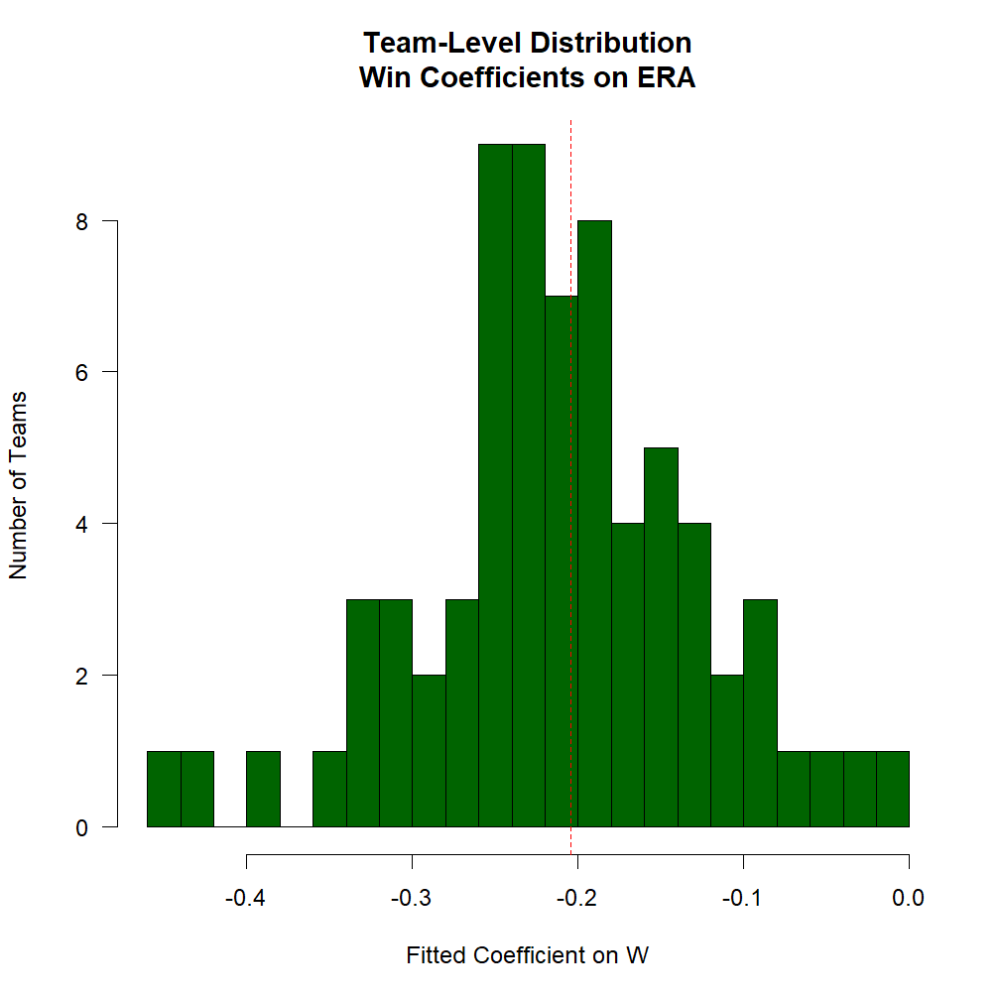

This vignette will explain the most common ways to use the `.SD` variable in your `data.table` analyses. It is an adaptation of [this answer](https://stackoverflow.com/a/47406952/3576984) given on StackOverflow.

# What is `.SD`?

In the broadest sense, `.SD` is just shorthand for capturing a variable that comes up frequently in the context of data analysis. It can be understood to stand for *S*ubset, *S*elfsame, or *S*elf-reference of the *D*ata. That is, `.SD` is in its most basic guise a _reflexive reference_ to the `data.table` itself -- as we'll see in examples below, this is particularly helpful for chaining together "queries" (extractions/subsets/etc using `[`). In particular, this also means that `.SD` is _itself a `data.table`_ (with the caveat that it does not allow assignment with `:=`).

The simpler usage of `.SD` is for column subsetting (i.e., when `.SDcols` is specified); as this version is much more straightforward to understand, we'll cover that first below. The interpretation of `.SD` in its second usage, grouping scenarios (i.e., when `by = ` or `keyby = ` is specified), is slightly different, conceptually (though at core it's the same, since, after all, a non-grouped operation is an edge case of grouping with just one group).

## Loading and Previewing Lahman Data

To give this a more real-world feel, rather than making up data, let's load some data sets about baseball from the [Lahman database](https://github.com/cdalzell/Lahman). In typical R usage, we'd simply load these data sets from the `Lahman` R package; in this vignette, we've pre-downloaded them directly from the package's GitHub page instead.


``` r
load('Teams.RData')
setDT(Teams)
Teams
#       yearID   lgID teamID franchID  divID  Rank     G Ghome     W     L DivWin
#        <int> <fctr> <fctr>   <fctr> <char> <int> <int> <int> <int> <int> <char>
#    1:   1871     NA    BS1      BNA   <NA>     3    31    NA    20    10   <NA>
#    2:   1871     NA    CH1      CNA   <NA>     2    28    NA    19     9   <NA>
#    3:   1871     NA    CL1      CFC   <NA>     8    29    NA    10    19   <NA>
#    4:   1871     NA    FW1      KEK   <NA>     7    19    NA     7    12   <NA>
#    5:   1871     NA    NY2      NNA   <NA>     5    33    NA    16    17   <NA>
#   ---                                                                          
# 2891:   2018     NL    SLN      STL      C     3   162    81    88    74      N
# 2892:   2018     AL    TBA      TBD      E     3   162    81    90    72      N
# 2893:   2018     AL    TEX      TEX      W     5   162    81    67    95      N
# 2894:   2018     AL    TOR      TOR      E     4   162    81    73    89      N
# 2895:   2018     NL    WAS      WSN      E     2   162    81    82    80      N
#        WCWin  LgWin  WSWin     R    AB     H   X2B   X3B    HR    BB    SO
#       <char> <char> <char> <int> <int> <int> <int> <int> <int> <num> <int>
#    1:   <NA>      N   <NA>   401  1372   426    70    37     3    60    19
#    2:   <NA>      N   <NA>   302  1196   323    52    21    10    60    22
#    3:   <NA>      N   <NA>   249  1186   328    35    40     7    26    25
#    4:   <NA>      N   <NA>   137   746   178    19     8     2    33     9
#    5:   <NA>      N   <NA>   302  1404   403    43    21     1    33    15
#   ---                                                                     
# 2891:      N      N      N   759  5498  1369   248     9   205   525  1380
# 2892:      N      N      N   716  5475  1415   274    43   150   540  1388
# 2893:      N      N      N   737  5453  1308   266    24   194   555  1484
# 2894:      N      N      N   709  5477  1336   320    16   217   499  1387
# 2895:      N      N      N   771  5517  1402   284    25   191   631  1289
#          SB    CS   HBP    SF    RA    ER   ERA    CG   SHO    SV IPouts    HA
#       <num> <num> <num> <int> <int> <int> <num> <int> <int> <int>  <int> <int>
#    1:    73    16    NA    NA   303   109  3.55    22     1     3    828   367
#    2:    69    21    NA    NA   241    77  2.76    25     0     1    753   308
#    3:    18     8    NA    NA   341   116  4.11    23     0     0    762   346
#    4:    16     4    NA    NA   243    97  5.17    19     1     0    507   261
#    5:    46    15    NA    NA   313   121  3.72    32     1     0    879   373
#   ---                                                                         
# 2891:    63    32    80    48   691   622  3.85     1     8    43   4366  1354
# 2892:   128    51   101    50   646   602  3.74     0    14    52   4345  1236
# 2893:    74    35    88    34   848   783  4.92     1     5    42   4293  1516
# 2894:    47    30    58    37   832   772  4.85     0     3    39   4301  1476
# 2895:   119    33    59    40   682   649  4.04     2     7    40   4338  1320
#         HRA   BBA   SOA     E    DP    FP                    name
#       <int> <int> <int> <int> <int> <num>                  <char>
#    1:     2    42    23   243    24 0.834    Boston Red Stockings
#    2:     6    28    22   229    16 0.829 Chicago White Stockings
#    3:    13    53    34   234    15 0.818  Cleveland Forest Citys
#    4:     5    21    17   163     8 0.803    Fort Wayne Kekiongas
#    5:     7    42    22   235    14 0.840        New York Mutuals
#   ---                                                            
# 2891:   144   593  1337   133   151 0.978     St. Louis Cardinals
# 2892:   164   501  1421    85   136 0.986          Tampa Bay Rays
# 2893:   222   491  1121   120   168 0.980           Texas Rangers
# 2894:   208   551  1298   101   138 0.983       Toronto Blue Jays
# 2895:   198   487  1417    64   115 0.989    Washington Nationals
#                                park attendance   BPF   PPF teamIDBR
#                              <char>      <int> <int> <int>   <char>
#    1:           South End Grounds I         NA   103    98      BOS
#    2:       Union Base-Ball Grounds         NA   104   102      CHI
#    3:  National Association Grounds         NA    96   100      CLE
#    4:                Hamilton Field         NA   101   107      KEK
#    5:      Union Grounds (Brooklyn)         NA    90    88      NYU
#   ---                                                              
# 2891:             Busch Stadium III    3403587    97    96      STL
# 2892:               Tropicana Field    1154973    97    97      TBR
# 2893: Rangers Ballpark in Arlington    2107107   112   113      TEX
# 2894:                 Rogers Centre    2325281    97    98      TOR
# 2895:                Nationals Park    2529604   106   105      WSN
#       teamIDlahman45 teamIDretro
#               <char>      <char>
#    1:            BS1         BS1
#    2:            CH1         CH1
#    3:            CL1         CL1
#    4:            FW1         FW1
#    5:            NY2         NY2
#   ---                           
# 2891:            SLN         SLN
# 2892:            TBA         TBA
# 2893:            TEX         TEX
# 2894:            TOR         TOR
# 2895:            MON         WAS

load('Pitching.RData')
setDT(Pitching)
Pitching
#         playerID yearID stint teamID   lgID     W     L     G    GS    CG   SHO
#           <char>  <int> <int> <fctr> <fctr> <int> <int> <int> <int> <int> <int>
#     1: bechtge01   1871     1    PH1     NA     1     2     3     3     2     0
#     2: brainas01   1871     1    WS3     NA    12    15    30    30    30     0
#     3: fergubo01   1871     1    NY2     NA     0     0     1     0     0     0
#     4: fishech01   1871     1    RC1     NA     4    16    24    24    22     1
#     5: fleetfr01   1871     1    NY2     NA     0     1     1     1     1     0
#    ---                                                                         
# 46695: zamorda01   2018     1    NYN     NL     1     0    16     0     0     0
# 46696: zastrro01   2018     1    CHN     NL     1     0     6     0     0     0
# 46697: zieglbr01   2018     1    MIA     NL     1     5    53     0     0     0
# 46698: zieglbr01   2018     2    ARI     NL     1     1    29     0     0     0
# 46699: zimmejo02   2018     1    DET     AL     7     8    25    25     0     0
#           SV IPouts     H    ER    HR    BB    SO BAOpp   ERA   IBB    WP   HBP
#        <int>  <int> <int> <int> <int> <int> <int> <num> <num> <int> <int> <num>
#     1:     0     78    43    23     0    11     1    NA  7.96    NA     7    NA
#     2:     0    792   361   132     4    37    13    NA  4.50    NA     7    NA
#     3:     0      3     8     3     0     0     0    NA 27.00    NA     2    NA
#     4:     0    639   295   103     3    31    15    NA  4.35    NA    20    NA
#     5:     0     27    20    10     0     3     0    NA 10.00    NA     0    NA
#    ---                                                                         
# 46695:     0     27     6     3     1     3    16 0.194  3.00     1     0     1
# 46696:     0     17     6     3     0     4     3 0.286  4.76     0     0     1
# 46697:    10    156    49    23     7    17    37 0.254  3.98     4     1     2
# 46698:     0     65    22     9     1     8    13 0.265  3.74     2     0     0
# 46699:     0    394   140    66    28    26   111 0.269  4.52     0     1     2
#           BK   BFP    GF     R    SH    SF  GIDP
#        <int> <int> <int> <int> <int> <int> <int>
#     1:     0   146     0    42    NA    NA    NA
#     2:     0  1291     0   292    NA    NA    NA
#     3:     0    14     0     9    NA    NA    NA
#     4:     0  1080     1   257    NA    NA    NA
#     5:     0    57     0    21    NA    NA    NA
#    ---                                          
# 46695:     0    36     4     3     1     0     1
# 46696:     0    26     2     3     0     0     0
# 46697:     0   213    23    25     0     1    11
# 46698:     0    92     1     9     0     1     3
# 46699:     0   556     0    76     2     5     4
```

Readers up on baseball lingo should find the tables' contents familiar; `Teams` records some statistics for a given team in a given year, while `Pitching` records statistics for a given pitcher in a given year. Please do check out the [documentation](https://github.com/cdalzell/Lahman) and explore the data yourself a bit before proceeding to familiarize yourself with their structure.

# `.SD` on Ungrouped Data

To illustrate what I mean about the reflexive nature of `.SD`, consider its most banal usage:


``` r
Pitching[ , .SD]
#         playerID yearID stint teamID   lgID     W     L     G    GS    CG   SHO
#           <char>  <int> <int> <fctr> <fctr> <int> <int> <int> <int> <int> <int>
#     1: bechtge01   1871     1    PH1     NA     1     2     3     3     2     0
#     2: brainas01   1871     1    WS3     NA    12    15    30    30    30     0
#     3: fergubo01   1871     1    NY2     NA     0     0     1     0     0     0
#     4: fishech01   1871     1    RC1     NA     4    16    24    24    22     1
#     5: fleetfr01   1871     1    NY2     NA     0     1     1     1     1     0
#    ---                                                                         
# 46695: zamorda01   2018     1    NYN     NL     1     0    16     0     0     0
# 46696: zastrro01   2018     1    CHN     NL     1     0     6     0     0     0
# 46697: zieglbr01   2018     1    MIA     NL     1     5    53     0     0     0
# 46698: zieglbr01   2018     2    ARI     NL     1     1    29     0     0     0
# 46699: zimmejo02   2018     1    DET     AL     7     8    25    25     0     0
#           SV IPouts     H    ER    HR    BB    SO BAOpp   ERA   IBB    WP   HBP
#        <int>  <int> <int> <int> <int> <int> <int> <num> <num> <int> <int> <num>
#     1:     0     78    43    23     0    11     1    NA  7.96    NA     7    NA
#     2:     0    792   361   132     4    37    13    NA  4.50    NA     7    NA
#     3:     0      3     8     3     0     0     0    NA 27.00    NA     2    NA
#     4:     0    639   295   103     3    31    15    NA  4.35    NA    20    NA
#     5:     0     27    20    10     0     3     0    NA 10.00    NA     0    NA
#    ---                                                                         
# 46695:     0     27     6     3     1     3    16 0.194  3.00     1     0     1
# 46696:     0     17     6     3     0     4     3 0.286  4.76     0     0     1
# 46697:    10    156    49    23     7    17    37 0.254  3.98     4     1     2
# 46698:     0     65    22     9     1     8    13 0.265  3.74     2     0     0
# 46699:     0    394   140    66    28    26   111 0.269  4.52     0     1     2
#           BK   BFP    GF     R    SH    SF  GIDP
#        <int> <int> <int> <int> <int> <int> <int>
#     1:     0   146     0    42    NA    NA    NA
#     2:     0  1291     0   292    NA    NA    NA
#     3:     0    14     0     9    NA    NA    NA
#     4:     0  1080     1   257    NA    NA    NA
#     5:     0    57     0    21    NA    NA    NA
#    ---                                          
# 46695:     0    36     4     3     1     0     1
# 46696:     0    26     2     3     0     0     0
# 46697:     0   213    23    25     0     1    11
# 46698:     0    92     1     9     0     1     3
# 46699:     0   556     0    76     2     5     4
```

That is, `Pitching[ , .SD]` has simply returned the whole table, i.e., this was an overly verbose way of writing `Pitching` or `Pitching[]`:


``` r
identical(Pitching, Pitching[ , .SD])
# [1] TRUE
```

In terms of subsetting, `.SD` is still a subset of the data, it's just a trivial one (the set itself).

## Column Subsetting: `.SDcols`

The first way to impact what `.SD` is is to limit the _columns_ contained in `.SD` using the `.SDcols` argument to `[`:


``` r
# W: Wins; L: Losses; G: Games
Pitching[ , .SD, .SDcols = c('W', 'L', 'G')]
#            W     L     G
#        <int> <int> <int>
#     1:     1     2     3
#     2:    12    15    30
#     3:     0     0     1
#     4:     4    16    24
#     5:     0     1     1
#    ---                  
# 46695:     1     0    16
# 46696:     1     0     6
# 46697:     1     5    53
# 46698:     1     1    29
# 46699:     7     8    25
```

This is just for illustration and was pretty boring. In addition to accepting a character vector, `.SDcols` also accepts:

1. any function such as `is.character` to filter _columns_
2. the function^{*} `patterns()` to filter _column names_ by regular expression
3. integer and logical vectors

*see `?patterns` for more details

This simple usage lends itself to a wide variety of highly beneficial / ubiquitous data manipulation operations:

## Column Type Conversion

Column type conversion is a fact of life for data munging. Though [`fwrite` recently gained the ability to declare the class of each column up front](https://github.com/Rdatatable/data.table/pull/2545), not all data sets come from `fread` (e.g. in this vignette) and conversions back and forth among `character`/`factor`/`numeric` types are common. We can use `.SD` and `.SDcols` to batch-convert groups of columns to a common type.

We notice that the following columns are stored as `character` in the `Teams` data set, but might more logically be stored as `factor`s:


``` r
# teamIDBR: Team ID used by Baseball Reference website
# teamIDlahman45: Team ID used in Lahman database version 4.5
# teamIDretro: Team ID used by Retrosheet
fkt = c('teamIDBR', 'teamIDlahman45', 'teamIDretro')
# confirm that they're stored as `character`
str(Teams[ , ..fkt])
# Classes 'data.table' and 'data.frame':	2895 obs. of  3 variables:
#  $ teamIDBR      : chr  "BOS" "CHI" "CLE" "KEK" ...
#  $ teamIDlahman45: chr  "BS1" "CH1" "CL1" "FW1" ...
#  $ teamIDretro   : chr  "BS1" "CH1" "CL1" "FW1" ...
#  - attr(*, ".internal.selfref")=<externalptr>
```

The syntax to now convert these columns to `factor` is simple:


``` r
Teams[ , names(.SD) := lapply(.SD, factor), .SDcols = patterns('teamID')]
#       yearID   lgID teamID franchID  divID  Rank     G Ghome     W     L DivWin
#        <int> <fctr> <fctr>   <fctr> <char> <int> <int> <int> <int> <int> <char>
#    1:   1871     NA    BS1      BNA   <NA>     3    31    NA    20    10   <NA>
#    2:   1871     NA    CH1      CNA   <NA>     2    28    NA    19     9   <NA>
#    3:   1871     NA    CL1      CFC   <NA>     8    29    NA    10    19   <NA>
#    4:   1871     NA    FW1      KEK   <NA>     7    19    NA     7    12   <NA>
#    5:   1871     NA    NY2      NNA   <NA>     5    33    NA    16    17   <NA>
#   ---                                                                          
# 2891:   2018     NL    SLN      STL      C     3   162    81    88    74      N
# 2892:   2018     AL    TBA      TBD      E     3   162    81    90    72      N
# 2893:   2018     AL    TEX      TEX      W     5   162    81    67    95      N
# 2894:   2018     AL    TOR      TOR      E     4   162    81    73    89      N
# 2895:   2018     NL    WAS      WSN      E     2   162    81    82    80      N
#        WCWin  LgWin  WSWin     R    AB     H   X2B   X3B    HR    BB    SO
#       <char> <char> <char> <int> <int> <int> <int> <int> <int> <num> <int>
#    1:   <NA>      N   <NA>   401  1372   426    70    37     3    60    19
#    2:   <NA>      N   <NA>   302  1196   323    52    21    10    60    22
#    3:   <NA>      N   <NA>   249  1186   328    35    40     7    26    25
#    4:   <NA>      N   <NA>   137   746   178    19     8     2    33     9
#    5:   <NA>      N   <NA>   302  1404   403    43    21     1    33    15
#   ---                                                                     
# 2891:      N      N      N   759  5498  1369   248     9   205   525  1380
# 2892:      N      N      N   716  5475  1415   274    43   150   540  1388
# 2893:      N      N      N   737  5453  1308   266    24   194   555  1484
# 2894:      N      N      N   709  5477  1336   320    16   217   499  1387
# 2895:      N      N      N   771  5517  1402   284    25   191   631  1289
#          SB    CS   HBP    SF    RA    ER   ERA    CG   SHO    SV IPouts    HA
#       <num> <num> <num> <int> <int> <int> <num> <int> <int> <int>  <int> <int>
#    1:    73    16    NA    NA   303   109  3.55    22     1     3    828   367
#    2:    69    21    NA    NA   241    77  2.76    25     0     1    753   308
#    3:    18     8    NA    NA   341   116  4.11    23     0     0    762   346
#    4:    16     4    NA    NA   243    97  5.17    19     1     0    507   261
#    5:    46    15    NA    NA   313   121  3.72    32     1     0    879   373
#   ---                                                                         
# 2891:    63    32    80    48   691   622  3.85     1     8    43   4366  1354
# 2892:   128    51   101    50   646   602  3.74     0    14    52   4345  1236
# 2893:    74    35    88    34   848   783  4.92     1     5    42   4293  1516
# 2894:    47    30    58    37   832   772  4.85     0     3    39   4301  1476
# 2895:   119    33    59    40   682   649  4.04     2     7    40   4338  1320
#         HRA   BBA   SOA     E    DP    FP                    name
#       <int> <int> <int> <int> <int> <num>                  <char>
#    1:     2    42    23   243    24 0.834    Boston Red Stockings
#    2:     6    28    22   229    16 0.829 Chicago White Stockings
#    3:    13    53    34   234    15 0.818  Cleveland Forest Citys
#    4:     5    21    17   163     8 0.803    Fort Wayne Kekiongas
#    5:     7    42    22   235    14 0.840        New York Mutuals
#   ---                                                            
# 2891:   144   593  1337   133   151 0.978     St. Louis Cardinals
# 2892:   164   501  1421    85   136 0.986          Tampa Bay Rays
# 2893:   222   491  1121   120   168 0.980           Texas Rangers
# 2894:   208   551  1298   101   138 0.983       Toronto Blue Jays
# 2895:   198   487  1417    64   115 0.989    Washington Nationals
#                                park attendance   BPF   PPF teamIDBR
#                              <char>      <int> <int> <int>   <fctr>
#    1:           South End Grounds I         NA   103    98      BOS
#    2:       Union Base-Ball Grounds         NA   104   102      CHI
#    3:  National Association Grounds         NA    96   100      CLE
#    4:                Hamilton Field         NA   101   107      KEK
#    5:      Union Grounds (Brooklyn)         NA    90    88      NYU
#   ---                                                              
# 2891:             Busch Stadium III    3403587    97    96      STL
# 2892:               Tropicana Field    1154973    97    97      TBR
# 2893: Rangers Ballpark in Arlington    2107107   112   113      TEX
# 2894:                 Rogers Centre    2325281    97    98      TOR
# 2895:                Nationals Park    2529604   106   105      WSN
#       teamIDlahman45 teamIDretro
#               <fctr>      <fctr>
#    1:            BS1         BS1
#    2:            CH1         CH1
#    3:            CL1         CL1
#    4:            FW1         FW1
#    5:            NY2         NY2
#   ---                           
# 2891:            SLN         SLN
# 2892:            TBA         TBA
# 2893:            TEX         TEX
# 2894:            TOR         TOR
# 2895:            MON         WAS
# print out the first column to demonstrate success
head(unique(Teams[[fkt[1L]]]))
# [1] BOS CHI CLE KEK NYU ATH
# 101 Levels: ALT ANA ARI ATH ATL BAL BLA BLN BLU BOS BRA BRG BRO BSN BTT ... WSN
```

Note: 

1. The `:=` is an assignment operator to update the `data.table` in place without making a copy. See [reference semantics](https://cran.r-project.org/package=data.table/vignettes/datatable-reference-semantics.html) for more. 
2. The LHS, `names(.SD)`, indicates which columns we are updating - in this case we update the entire `.SD`.
3. The RHS, `lapply()`, loops through each column of the `.SD` and converts the column to a factor.
4. We use the `.SDcols` to only select columns that have pattern of `teamID`.

Again, the `.SDcols` argument is quite flexible; above, we supplied `patterns` but we could have also supplied `fkt` or any `character` vector of column names. In other situations, it is more convenient to supply an `integer` vector of column _positions_ or a `logical` vector dictating include/exclude for each column. Finally, the use of a function to filter columns is very helpful.

For example, we could do the following to convert all `factor` columns to `character`:


``` r
fct_idx = Teams[, which(sapply(.SD, is.factor))] # column numbers to show the class changing
str(Teams[[fct_idx[1L]]])
#  Factor w/ 7 levels "AA","AL","FL",..: 4 4 4 4 4 4 4 4 4 4 ...
Teams[ , names(.SD) := lapply(.SD, as.character), .SDcols = is.factor]
#       yearID   lgID teamID franchID  divID  Rank     G Ghome     W     L DivWin
#        <int> <char> <char>   <char> <char> <int> <int> <int> <int> <int> <char>
#    1:   1871     NA    BS1      BNA   <NA>     3    31    NA    20    10   <NA>
#    2:   1871     NA    CH1      CNA   <NA>     2    28    NA    19     9   <NA>
#    3:   1871     NA    CL1      CFC   <NA>     8    29    NA    10    19   <NA>
#    4:   1871     NA    FW1      KEK   <NA>     7    19    NA     7    12   <NA>
#    5:   1871     NA    NY2      NNA   <NA>     5    33    NA    16    17   <NA>
#   ---                                                                          
# 2891:   2018     NL    SLN      STL      C     3   162    81    88    74      N
# 2892:   2018     AL    TBA      TBD      E     3   162    81    90    72      N
# 2893:   2018     AL    TEX      TEX      W     5   162    81    67    95      N
# 2894:   2018     AL    TOR      TOR      E     4   162    81    73    89      N
# 2895:   2018     NL    WAS      WSN      E     2   162    81    82    80      N
#        WCWin  LgWin  WSWin     R    AB     H   X2B   X3B    HR    BB    SO
#       <char> <char> <char> <int> <int> <int> <int> <int> <int> <num> <int>
#    1:   <NA>      N   <NA>   401  1372   426    70    37     3    60    19
#    2:   <NA>      N   <NA>   302  1196   323    52    21    10    60    22
#    3:   <NA>      N   <NA>   249  1186   328    35    40     7    26    25
#    4:   <NA>      N   <NA>   137   746   178    19     8     2    33     9
#    5:   <NA>      N   <NA>   302  1404   403    43    21     1    33    15
#   ---                                                                     
# 2891:      N      N      N   759  5498  1369   248     9   205   525  1380
# 2892:      N      N      N   716  5475  1415   274    43   150   540  1388
# 2893:      N      N      N   737  5453  1308   266    24   194   555  1484
# 2894:      N      N      N   709  5477  1336   320    16   217   499  1387
# 2895:      N      N      N   771  5517  1402   284    25   191   631  1289
#          SB    CS   HBP    SF    RA    ER   ERA    CG   SHO    SV IPouts    HA
#       <num> <num> <num> <int> <int> <int> <num> <int> <int> <int>  <int> <int>
#    1:    73    16    NA    NA   303   109  3.55    22     1     3    828   367
#    2:    69    21    NA    NA   241    77  2.76    25     0     1    753   308
#    3:    18     8    NA    NA   341   116  4.11    23     0     0    762   346
#    4:    16     4    NA    NA   243    97  5.17    19     1     0    507   261
#    5:    46    15    NA    NA   313   121  3.72    32     1     0    879   373
#   ---                                                                         
# 2891:    63    32    80    48   691   622  3.85     1     8    43   4366  1354
# 2892:   128    51   101    50   646   602  3.74     0    14    52   4345  1236
# 2893:    74    35    88    34   848   783  4.92     1     5    42   4293  1516
# 2894:    47    30    58    37   832   772  4.85     0     3    39   4301  1476
# 2895:   119    33    59    40   682   649  4.04     2     7    40   4338  1320
#         HRA   BBA   SOA     E    DP    FP                    name
#       <int> <int> <int> <int> <int> <num>                  <char>
#    1:     2    42    23   243    24 0.834    Boston Red Stockings
#    2:     6    28    22   229    16 0.829 Chicago White Stockings
#    3:    13    53    34   234    15 0.818  Cleveland Forest Citys
#    4:     5    21    17   163     8 0.803    Fort Wayne Kekiongas
#    5:     7    42    22   235    14 0.840        New York Mutuals
#   ---                                                            
# 2891:   144   593  1337   133   151 0.978     St. Louis Cardinals
# 2892:   164   501  1421    85   136 0.986          Tampa Bay Rays
# 2893:   222   491  1121   120   168 0.980           Texas Rangers
# 2894:   208   551  1298   101   138 0.983       Toronto Blue Jays
# 2895:   198   487  1417    64   115 0.989    Washington Nationals
#                                park attendance   BPF   PPF teamIDBR
#                              <char>      <int> <int> <int>   <char>
#    1:           South End Grounds I         NA   103    98      BOS
#    2:       Union Base-Ball Grounds         NA   104   102      CHI
#    3:  National Association Grounds         NA    96   100      CLE
#    4:                Hamilton Field         NA   101   107      KEK
#    5:      Union Grounds (Brooklyn)         NA    90    88      NYU
#   ---                                                              
# 2891:             Busch Stadium III    3403587    97    96      STL
# 2892:               Tropicana Field    1154973    97    97      TBR
# 2893: Rangers Ballpark in Arlington    2107107   112   113      TEX
# 2894:                 Rogers Centre    2325281    97    98      TOR
# 2895:                Nationals Park    2529604   106   105      WSN
#       teamIDlahman45 teamIDretro
#               <char>      <char>
#    1:            BS1         BS1
#    2:            CH1         CH1
#    3:            CL1         CL1
#    4:            FW1         FW1
#    5:            NY2         NY2
#   ---                           
# 2891:            SLN         SLN
# 2892:            TBA         TBA
# 2893:            TEX         TEX
# 2894:            TOR         TOR
# 2895:            MON         WAS
str(Teams[[fct_idx[1L]]])
#  chr [1:2895] "NA" "NA" "NA" "NA" "NA" "NA" "NA" "NA" "NA" "NA" "NA" "NA" ...
```

Lastly, we can do pattern-based matching of columns in `.SDcols` to select all columns which contain `team` back to `factor`:


``` r
Teams[ , .SD, .SDcols = patterns('team')]
#       teamID teamIDBR teamIDlahman45 teamIDretro
#       <char>   <char>         <char>      <char>
#    1:    BS1      BOS            BS1         BS1
#    2:    CH1      CHI            CH1         CH1
#    3:    CL1      CLE            CL1         CL1
#    4:    FW1      KEK            FW1         FW1
#    5:    NY2      NYU            NY2         NY2
#   ---                                           
# 2891:    SLN      STL            SLN         SLN
# 2892:    TBA      TBR            TBA         TBA
# 2893:    TEX      TEX            TEX         TEX
# 2894:    TOR      TOR            TOR         TOR
# 2895:    WAS      WSN            MON         WAS
Teams[ , names(.SD) := lapply(.SD, factor), .SDcols = patterns('team')]
#       yearID   lgID teamID franchID  divID  Rank     G Ghome     W     L DivWin
#        <int> <char> <fctr>   <char> <char> <int> <int> <int> <int> <int> <char>
#    1:   1871     NA    BS1      BNA   <NA>     3    31    NA    20    10   <NA>
#    2:   1871     NA    CH1      CNA   <NA>     2    28    NA    19     9   <NA>
#    3:   1871     NA    CL1      CFC   <NA>     8    29    NA    10    19   <NA>
#    4:   1871     NA    FW1      KEK   <NA>     7    19    NA     7    12   <NA>
#    5:   1871     NA    NY2      NNA   <NA>     5    33    NA    16    17   <NA>
#   ---                                                                          
# 2891:   2018     NL    SLN      STL      C     3   162    81    88    74      N
# 2892:   2018     AL    TBA      TBD      E     3   162    81    90    72      N
# 2893:   2018     AL    TEX      TEX      W     5   162    81    67    95      N
# 2894:   2018     AL    TOR      TOR      E     4   162    81    73    89      N
# 2895:   2018     NL    WAS      WSN      E     2   162    81    82    80      N
#        WCWin  LgWin  WSWin     R    AB     H   X2B   X3B    HR    BB    SO
#       <char> <char> <char> <int> <int> <int> <int> <int> <int> <num> <int>
#    1:   <NA>      N   <NA>   401  1372   426    70    37     3    60    19
#    2:   <NA>      N   <NA>   302  1196   323    52    21    10    60    22
#    3:   <NA>      N   <NA>   249  1186   328    35    40     7    26    25
#    4:   <NA>      N   <NA>   137   746   178    19     8     2    33     9
#    5:   <NA>      N   <NA>   302  1404   403    43    21     1    33    15
#   ---                                                                     
# 2891:      N      N      N   759  5498  1369   248     9   205   525  1380
# 2892:      N      N      N   716  5475  1415   274    43   150   540  1388
# 2893:      N      N      N   737  5453  1308   266    24   194   555  1484
# 2894:      N      N      N   709  5477  1336   320    16   217   499  1387
# 2895:      N      N      N   771  5517  1402   284    25   191   631  1289
#          SB    CS   HBP    SF    RA    ER   ERA    CG   SHO    SV IPouts    HA
#       <num> <num> <num> <int> <int> <int> <num> <int> <int> <int>  <int> <int>
#    1:    73    16    NA    NA   303   109  3.55    22     1     3    828   367
#    2:    69    21    NA    NA   241    77  2.76    25     0     1    753   308
#    3:    18     8    NA    NA   341   116  4.11    23     0     0    762   346
#    4:    16     4    NA    NA   243    97  5.17    19     1     0    507   261
#    5:    46    15    NA    NA   313   121  3.72    32     1     0    879   373
#   ---                                                                         
# 2891:    63    32    80    48   691   622  3.85     1     8    43   4366  1354
# 2892:   128    51   101    50   646   602  3.74     0    14    52   4345  1236
# 2893:    74    35    88    34   848   783  4.92     1     5    42   4293  1516
# 2894:    47    30    58    37   832   772  4.85     0     3    39   4301  1476
# 2895:   119    33    59    40   682   649  4.04     2     7    40   4338  1320
#         HRA   BBA   SOA     E    DP    FP                    name
#       <int> <int> <int> <int> <int> <num>                  <char>
#    1:     2    42    23   243    24 0.834    Boston Red Stockings
#    2:     6    28    22   229    16 0.829 Chicago White Stockings
#    3:    13    53    34   234    15 0.818  Cleveland Forest Citys
#    4:     5    21    17   163     8 0.803    Fort Wayne Kekiongas
#    5:     7    42    22   235    14 0.840        New York Mutuals
#   ---                                                            
# 2891:   144   593  1337   133   151 0.978     St. Louis Cardinals
# 2892:   164   501  1421    85   136 0.986          Tampa Bay Rays
# 2893:   222   491  1121   120   168 0.980           Texas Rangers
# 2894:   208   551  1298   101   138 0.983       Toronto Blue Jays
# 2895:   198   487  1417    64   115 0.989    Washington Nationals
#                                park attendance   BPF   PPF teamIDBR
#                              <char>      <int> <int> <int>   <fctr>
#    1:           South End Grounds I         NA   103    98      BOS
#    2:       Union Base-Ball Grounds         NA   104   102      CHI
#    3:  National Association Grounds         NA    96   100      CLE
#    4:                Hamilton Field         NA   101   107      KEK
#    5:      Union Grounds (Brooklyn)         NA    90    88      NYU
#   ---                                                              
# 2891:             Busch Stadium III    3403587    97    96      STL
# 2892:               Tropicana Field    1154973    97    97      TBR
# 2893: Rangers Ballpark in Arlington    2107107   112   113      TEX
# 2894:                 Rogers Centre    2325281    97    98      TOR
# 2895:                Nationals Park    2529604   106   105      WSN
#       teamIDlahman45 teamIDretro
#               <fctr>      <fctr>
#    1:            BS1         BS1
#    2:            CH1         CH1
#    3:            CL1         CL1
#    4:            FW1         FW1
#    5:            NY2         NY2
#   ---                           
# 2891:            SLN         SLN
# 2892:            TBA         TBA
# 2893:            TEX         TEX
# 2894:            TOR         TOR
# 2895:            MON         WAS
```

** A proviso to the above: _explicitly_ using column numbers (like `DT[ , (1) := rnorm(.N)]`) is bad practice and can lead to silently corrupted code over time if column positions change. Even implicitly using numbers can be dangerous if we don't keep smart/strict control over the ordering of when we create the numbered index and when we use it.

## Controlling a Model's Right-Hand Side

Varying model specification is a core feature of robust statistical analysis. Let's try and predict a pitcher's ERA (Earned Runs Average, a measure of performance) using the small set of covariates available in the `Pitching` table. How does the (linear) relationship between `W` (wins) and `ERA` vary depending on which other covariates are included in the specification?

Here's a short script leveraging the power of `.SD` which explores this question:


``` r
# this generates a list of the 2^k possible extra variables
#   for models of the form ERA ~ G + (...)
extra_var = c('yearID', 'teamID', 'G', 'L')
models = unlist(
  lapply(0L:length(extra_var), combn, x = extra_var, simplify = FALSE),
  recursive = FALSE
)

# here are 16 visually distinct colors, taken from the list of 20 here:
#   https://sashat.me/2017/01/11/list-of-20-simple-distinct-colors/
col16 = c('#e6194b', '#3cb44b', '#ffe119', '#0082c8',
          '#f58231', '#911eb4', '#46f0f0', '#f032e6',
          '#d2f53c', '#fabebe', '#008080', '#e6beff',
          '#aa6e28', '#fffac8', '#800000', '#aaffc3')

par(oma = c(2, 0, 0, 0))
lm_coef = sapply(models, function(rhs) {
  # using ERA ~ . and data = .SD, then varying which
  #   columns are included in .SD allows us to perform this
  #   iteration over 16 models succinctly.
  #   coef(.)['W'] extracts the W coefficient from each model fit
  Pitching[ , coef(lm(ERA ~ ., data = .SD))['W'], .SDcols = c('W', rhs)]
})
barplot(lm_coef, names.arg = sapply(models, paste, collapse = '/'),
        main = 'Wins Coefficient\nWith Various Covariates',
        col = col16, las = 2L, cex.names = 0.8)
```

<div class="figure">

<p class="caption">Fit OLS coefficient on W, various specifications, depicted as bars with distinct colors.</p>
</div>

The coefficient always has the expected sign (better pitchers tend to have more wins and fewer runs allowed), but the magnitude can vary substantially depending on what else we control for.

## Conditional Joins

`data.table` syntax is beautiful for its simplicity and robustness. The syntax `x[i]` flexibly handles three common approaches to subsetting -- when `i` is a `logical` vector, `x[i]` will return those rows of `x` corresponding to where `i` is `TRUE`; when `i` is _another `data.table`_ (or a `list`), a (right) `join` is performed (in the plain form, using the `key`s of `x` and `i`, otherwise, when `on = ` is specified, using matches of those columns); and when `i` is a character, it is interpreted as shorthand for `x[list(i)]`, i.e., as a join.

This is great in general, but falls short when we wish to perform a _conditional join_, wherein the exact nature of the relationship among tables depends on some characteristics of the rows in one or more columns.

This example is admittedly a tad contrived, but illustrates the idea; see here ([1](https://stackoverflow.com/questions/31329939/conditional-keyed-join-update-and-update-a-flag-column-for-matches), [2](https://stackoverflow.com/questions/29658627/conditional-binary-join-and-update-by-reference-using-the-data-table-package)) for more.

The goal is to add a column `team_performance` to the `Pitching` table that records the team's performance (rank) of the best pitcher on each team (as measured by the lowest ERA, among pitchers with at least 6 recorded games).


``` r
# to exclude pitchers with exceptional performance in a few games,
#   subset first; then define rank of pitchers within their team each year
#   (in general, we should put more care into the 'ties.method' of frank)
Pitching[G > 5, rank_in_team := frank(ERA), by = .(teamID, yearID)]
#         playerID yearID stint teamID   lgID     W     L     G    GS    CG   SHO
#           <char>  <int> <int> <fctr> <fctr> <int> <int> <int> <int> <int> <int>
#     1: bechtge01   1871     1    PH1     NA     1     2     3     3     2     0
#     2: brainas01   1871     1    WS3     NA    12    15    30    30    30     0
#     3: fergubo01   1871     1    NY2     NA     0     0     1     0     0     0
#     4: fishech01   1871     1    RC1     NA     4    16    24    24    22     1
#     5: fleetfr01   1871     1    NY2     NA     0     1     1     1     1     0
#    ---                                                                         
# 46695: zamorda01   2018     1    NYN     NL     1     0    16     0     0     0
# 46696: zastrro01   2018     1    CHN     NL     1     0     6     0     0     0
# 46697: zieglbr01   2018     1    MIA     NL     1     5    53     0     0     0
# 46698: zieglbr01   2018     2    ARI     NL     1     1    29     0     0     0
# 46699: zimmejo02   2018     1    DET     AL     7     8    25    25     0     0
#           SV IPouts     H    ER    HR    BB    SO BAOpp   ERA   IBB    WP   HBP
#        <int>  <int> <int> <int> <int> <int> <int> <num> <num> <int> <int> <num>
#     1:     0     78    43    23     0    11     1    NA  7.96    NA     7    NA
#     2:     0    792   361   132     4    37    13    NA  4.50    NA     7    NA
#     3:     0      3     8     3     0     0     0    NA 27.00    NA     2    NA
#     4:     0    639   295   103     3    31    15    NA  4.35    NA    20    NA
#     5:     0     27    20    10     0     3     0    NA 10.00    NA     0    NA
#    ---                                                                         
# 46695:     0     27     6     3     1     3    16 0.194  3.00     1     0     1
# 46696:     0     17     6     3     0     4     3 0.286  4.76     0     0     1
# 46697:    10    156    49    23     7    17    37 0.254  3.98     4     1     2
# 46698:     0     65    22     9     1     8    13 0.265  3.74     2     0     0
# 46699:     0    394   140    66    28    26   111 0.269  4.52     0     1     2
#           BK   BFP    GF     R    SH    SF  GIDP rank_in_team
#        <int> <int> <int> <int> <int> <int> <int>        <num>
#     1:     0   146     0    42    NA    NA    NA           NA
#     2:     0  1291     0   292    NA    NA    NA          1.0
#     3:     0    14     0     9    NA    NA    NA           NA
#     4:     0  1080     1   257    NA    NA    NA          1.0
#     5:     0    57     0    21    NA    NA    NA           NA
#    ---                                                       
# 46695:     0    36     4     3     1     0     1          4.0
# 46696:     0    26     2     3     0     0     0         21.0
# 46697:     0   213    23    25     0     1    11          4.5
# 46698:     0    92     1     9     0     1     3         11.0
# 46699:     0   556     0    76     2     5     4         10.0
Pitching[rank_in_team == 1, team_performance :=
           Teams[.SD, Rank, on = c('teamID', 'yearID')]]
# Índice: <rank_in_team>
#         playerID yearID stint teamID   lgID     W     L     G    GS    CG   SHO
#           <char>  <int> <int> <fctr> <fctr> <int> <int> <int> <int> <int> <int>
#     1: bechtge01   1871     1    PH1     NA     1     2     3     3     2     0
#     2: brainas01   1871     1    WS3     NA    12    15    30    30    30     0
#     3: fergubo01   1871     1    NY2     NA     0     0     1     0     0     0
#     4: fishech01   1871     1    RC1     NA     4    16    24    24    22     1
#     5: fleetfr01   1871     1    NY2     NA     0     1     1     1     1     0
#    ---                                                                         
# 46695: zamorda01   2018     1    NYN     NL     1     0    16     0     0     0
# 46696: zastrro01   2018     1    CHN     NL     1     0     6     0     0     0
# 46697: zieglbr01   2018     1    MIA     NL     1     5    53     0     0     0
# 46698: zieglbr01   2018     2    ARI     NL     1     1    29     0     0     0
# 46699: zimmejo02   2018     1    DET     AL     7     8    25    25     0     0
#           SV IPouts     H    ER    HR    BB    SO BAOpp   ERA   IBB    WP   HBP
#        <int>  <int> <int> <int> <int> <int> <int> <num> <num> <int> <int> <num>
#     1:     0     78    43    23     0    11     1    NA  7.96    NA     7    NA
#     2:     0    792   361   132     4    37    13    NA  4.50    NA     7    NA
#     3:     0      3     8     3     0     0     0    NA 27.00    NA     2    NA
#     4:     0    639   295   103     3    31    15    NA  4.35    NA    20    NA
#     5:     0     27    20    10     0     3     0    NA 10.00    NA     0    NA
#    ---                                                                         
# 46695:     0     27     6     3     1     3    16 0.194  3.00     1     0     1
# 46696:     0     17     6     3     0     4     3 0.286  4.76     0     0     1
# 46697:    10    156    49    23     7    17    37 0.254  3.98     4     1     2
# 46698:     0     65    22     9     1     8    13 0.265  3.74     2     0     0
# 46699:     0    394   140    66    28    26   111 0.269  4.52     0     1     2
#           BK   BFP    GF     R    SH    SF  GIDP rank_in_team team_performance
#        <int> <int> <int> <int> <int> <int> <int>        <num>            <int>
#     1:     0   146     0    42    NA    NA    NA           NA               NA
#     2:     0  1291     0   292    NA    NA    NA          1.0                4
#     3:     0    14     0     9    NA    NA    NA           NA               NA
#     4:     0  1080     1   257    NA    NA    NA          1.0                9
#     5:     0    57     0    21    NA    NA    NA           NA               NA
#    ---                                                                        
# 46695:     0    36     4     3     1     0     1          4.0               NA
# 46696:     0    26     2     3     0     0     0         21.0               NA
# 46697:     0   213    23    25     0     1    11          4.5               NA
# 46698:     0    92     1     9     0     1     3         11.0               NA
# 46699:     0   556     0    76     2     5     4         10.0               NA
```

Note that the `x[y]` syntax returns `nrow(y)` values (i.e., it's a right join), which is why `.SD` is on the right in `Teams[.SD]` (since the RHS of `:=` in this case requires `nrow(Pitching[rank_in_team == 1])` values).

# Grouped `.SD` operations

Often, we'd like to perform some operation on our data _at the group level_. When we specify `by =` (or `keyby = `), the mental model for what happens when `data.table` processes `j` is to think of your `data.table` as being split into many component sub-`data.table`s, each of which corresponds to a single value of your `by` variable(s):


<!-- 'A visual depiction of how grouping works. On the left is a grid. The first column is titled "ID COLUMN" with values the capital letters A through G, and the rest of the data is unlabelled, but is in a darker color and simply has "Data" written to indicate that's arbitrary. A right arrow shows how this data is split into groups. Each capital letter A through G has a grid on the right-hand side; the grid on the left has been subdivided to create that on the right.' -->

In the case of grouping, `.SD` is multiple in nature -- it refers to _each_ of these sub-`data.table`s, _one-at-a-time_ (slightly more accurately, the scope of `.SD` is a single sub-`data.table`). This allows us to concisely express an operation that we'd like to perform on _each sub-`data.table`_ before the re-assembled result is returned to us.

This is useful in a variety of settings, the most common of which are presented here:

## Group Subsetting

Let's get the most recent season of data for each team in the Lahman data. This can be done quite simply with:


``` r
# the data is already sorted by year; if it weren't
#   we could do Teams[order(yearID), .SD[.N], by = teamID]
Teams[ , .SD[.N], by = teamID]
#      teamID yearID   lgID franchID  divID  Rank     G Ghome     W     L DivWin
#      <fctr>  <int> <char>   <char> <char> <int> <int> <int> <int> <int> <char>
#   1:    BS1   1875     NA      BNA   <NA>     1    82    NA    71     8   <NA>
#   2:    CH1   1871     NA      CNA   <NA>     2    28    NA    19     9   <NA>
#   3:    CL1   1872     NA      CFC   <NA>     7    22    NA     6    16   <NA>
#   4:    FW1   1871     NA      KEK   <NA>     7    19    NA     7    12   <NA>
#   5:    NY2   1875     NA      NNA   <NA>     6    71    NA    30    38   <NA>
#  ---                                                                          
# 145:    ANA   2004     AL      ANA      W     1   162    81    92    70      Y
# 146:    ARI   2018     NL      ARI      W     3   162    81    82    80      N
# 147:    MIL   2018     NL      MIL      C     1   163    81    96    67      Y
# 148:    TBA   2018     AL      TBD      E     3   162    81    90    72      N
# 149:    MIA   2018     NL      FLA      E     5   161    81    63    98      N
#       WCWin  LgWin  WSWin     R    AB     H   X2B   X3B    HR    BB    SO    SB
#      <char> <char> <char> <int> <int> <int> <int> <int> <int> <num> <int> <num>
#   1:   <NA>      Y   <NA>   831  3515  1128   167    51    15    33    52    93
#   2:   <NA>      N   <NA>   302  1196   323    52    21    10    60    22    69
#   3:   <NA>      N   <NA>   174   943   272    28     5     0    17    13    12
#   4:   <NA>      N   <NA>   137   746   178    19     8     2    33     9    16
#   5:   <NA>      N   <NA>   328  2685   633    82    21     7    19    47    20
#  ---                                                                           
# 145:      N      N      N   836  5675  1603   272    37   162   450   942   143
# 146:      N      N      N   693  5460  1283   259    50   176   560  1460    79
# 147:      N      N      N   754  5542  1398   252    24   218   537  1458   124
# 148:      N      N      N   716  5475  1415   274    43   150   540  1388   128
# 149:      N      N      N   589  5488  1303   222    24   128   455  1384    45
#         CS   HBP    SF    RA    ER   ERA    CG   SHO    SV IPouts    HA   HRA
#      <num> <num> <int> <int> <int> <num> <int> <int> <int>  <int> <int> <int>
#   1:    37    NA    NA   343   152  1.87    60    10    17   2196   751     2
#   2:    21    NA    NA   241    77  2.76    25     0     1    753   308     6
#   3:     3    NA    NA   254   126  5.70    15     0     0    597   285     6
#   4:     4    NA    NA   243    97  5.17    19     1     0    507   261     5
#   5:    24    NA    NA   425   174  2.46    70     3     0   1910   718     4
#  ---                                                                         
# 145:    46    73    41   734   692  4.28     2    11    50   4363  1476   170
# 146:    25    52    45   644   605  3.72     2     9    39   4389  1313   174
# 147:    32    58    41   659   606  3.73     0    14    49   4383  1259   173
# 148:    51   101    50   646   602  3.74     0    14    52   4345  1236   164
# 149:    31    73    31   809   762  4.76     1    12    30   4326  1388   192
#        BBA   SOA     E    DP    FP                    name
#      <int> <int> <int> <int> <num>                  <char>
#   1:    33   110   483    56 0.870    Boston Red Stockings
#   2:    28    22   229    16 0.829 Chicago White Stockings
#   3:    24    11   184    17 0.816  Cleveland Forest Citys
#   4:    21    17   163     8 0.803    Fort Wayne Kekiongas
#   5:    21    77   526    30 0.838        New York Mutuals
#  ---                                                      
# 145:   502  1164    90   126 0.985          Anaheim Angels
# 146:   522  1448    75   152 0.988    Arizona Diamondbacks
# 147:   553  1428   108   141 0.982       Milwaukee Brewers
# 148:   501  1421    85   136 0.986          Tampa Bay Rays
# 149:   605  1249    83   133 0.986           Miami Marlins
#                              park attendance   BPF   PPF teamIDBR
#                            <char>      <int> <int> <int>   <fctr>
#   1:          South End Grounds I         NA   103    96      BOS
#   2:      Union Base-Ball Grounds         NA   104   102      CHI
#   3: National Association Grounds         NA    96   100      CLE
#   4:               Hamilton Field         NA   101   107      KEK
#   5:     Union Grounds (Brooklyn)         NA    99   100      NYU
#  ---                                                             
# 145:    Angels Stadium of Anaheim    3375677    97    97      ANA
# 146:                  Chase Field    2242695   108   107      ARI
# 147:                  Miller Park    2850875   102   101      MIL
# 148:              Tropicana Field    1154973    97    97      TBR
# 149:                 Marlins Park     811104    89    90      MIA
#      teamIDlahman45 teamIDretro
#              <fctr>      <fctr>
#   1:            BS1         BS1
#   2:            CH1         CH1
#   3:            CL1         CL1
#   4:            FW1         FW1
#   5:            NY2         NY2
#  ---                           
# 145:            ANA         ANA
# 146:            ARI         ARI
# 147:            ML4         MIL
# 148:            TBA         TBA
# 149:            FLO         MIA
```

Recall that `.SD` is itself a `data.table`, and that `.N` refers to the total number of rows in a group (it's equal to `nrow(.SD)` within each group), so `.SD[.N]` returns the _entirety of `.SD`_ for the final row associated with each `teamID`.

Another common version of this is to use `.SD[1L]` instead to get the _first_ observation for each group, or `.SD[sample(.N, 1L)]` to return a _random_ row for each group.

## Group Optima

Suppose we wanted to return the _best_ year for each team, as measured by their total number of runs scored (`R`; we could easily adjust this to refer to other metrics, of course). Instead of taking a _fixed_ element from each sub-`data.table`, we now define the desired index _dynamically_ as follows:


``` r
Teams[ , .SD[which.max(R)], by = teamID]
#      teamID yearID   lgID franchID  divID  Rank     G Ghome     W     L DivWin
#      <fctr>  <int> <char>   <char> <char> <int> <int> <int> <int> <int> <char>
#   1:    BS1   1875     NA      BNA   <NA>     1    82    NA    71     8   <NA>
#   2:    CH1   1871     NA      CNA   <NA>     2    28    NA    19     9   <NA>
#   3:    CL1   1871     NA      CFC   <NA>     8    29    NA    10    19   <NA>
#   4:    FW1   1871     NA      KEK   <NA>     7    19    NA     7    12   <NA>
#   5:    NY2   1872     NA      NNA   <NA>     3    56    NA    34    20   <NA>
#  ---                                                                          
# 145:    ANA   2000     AL      ANA      W     3   162    81    82    80      N
# 146:    ARI   1999     NL      ARI      W     1   162    81   100    62      Y
# 147:    MIL   1999     NL      MIL      C     5   161    80    74    87      N
# 148:    TBA   2009     AL      TBD      E     3   162    81    84    78      N
# 149:    MIA   2017     NL      FLA      E     2   162    78    77    85      N
#       WCWin  LgWin  WSWin     R    AB     H   X2B   X3B    HR    BB    SO    SB
#      <char> <char> <char> <int> <int> <int> <int> <int> <int> <num> <int> <num>
#   1:   <NA>      Y   <NA>   831  3515  1128   167    51    15    33    52    93
#   2:   <NA>      N   <NA>   302  1196   323    52    21    10    60    22    69
#   3:   <NA>      N   <NA>   249  1186   328    35    40     7    26    25    18
#   4:   <NA>      N   <NA>   137   746   178    19     8     2    33     9    16
#   5:   <NA>      N   <NA>   523  2426   670    87    14     4    58    52    59
#  ---                                                                           
# 145:      N      N      N   864  5628  1574   309    34   236   608  1024    93
# 146:      N      N      N   908  5658  1566   289    46   216   588  1045   137
# 147:      N      N      N   815  5582  1524   299    30   165   658  1065    81
# 148:      N      N      N   803  5462  1434   297    36   199   642  1229   194
# 149:      N      N      N   778  5602  1497   271    31   194   486  1282    91
#         CS   HBP    SF    RA    ER   ERA    CG   SHO    SV IPouts    HA   HRA
#      <num> <num> <int> <int> <int> <num> <int> <int> <int>  <int> <int> <int>
#   1:    37    NA    NA   343   152  1.87    60    10    17   2196   751     2
#   2:    21    NA    NA   241    77  2.76    25     0     1    753   308     6
#   3:     8    NA    NA   341   116  4.11    23     0     0    762   346    13
#   4:     4    NA    NA   243    97  5.17    19     1     0    507   261     5
#   5:    22    NA    NA   362   172  3.02    54     3     1   1536   622     2
#  ---                                                                         
# 145:    52    47    43   869   805  5.00     5     3    46   4344  1534   228
# 146:    39    48    60   676   615  3.77    16     9    42   4402  1387   176
# 147:    33    55    51   886   813  5.07     2     5    40   4328  1618   213
# 148:    61    49    45   754   686  4.33     3     5    41   4282  1421   183
# 149:    30    67    41   822   772  4.82     1     7    34   4328  1450   193
#        BBA   SOA     E    DP    FP                    name
#      <int> <int> <int> <int> <num>                  <char>
#   1:    33   110   483    56 0.870    Boston Red Stockings
#   2:    28    22   229    16 0.829 Chicago White Stockings
#   3:    53    34   234    15 0.818  Cleveland Forest Citys
#   4:    21    17   163     8 0.803    Fort Wayne Kekiongas
#   5:    33    46   323    33 0.868        New York Mutuals
#  ---                                                      
# 145:   662   846   134   182 0.978          Anaheim Angels
# 146:   543  1198   104   132 0.983    Arizona Diamondbacks
# 147:   616   987   127   146 0.979       Milwaukee Brewers
# 148:   515  1125    98   135 0.983          Tampa Bay Rays
# 149:   627  1202    73   156 0.988           Miami Marlins
#                              park attendance   BPF   PPF teamIDBR
#                            <char>      <int> <int> <int>   <fctr>
#   1:          South End Grounds I         NA   103    96      BOS
#   2:      Union Base-Ball Grounds         NA   104   102      CHI
#   3: National Association Grounds         NA    96   100      CLE
#   4:               Hamilton Field         NA   101   107      KEK
#   5:     Union Grounds (Brooklyn)         NA    93    92      NYU
#  ---                                                             
# 145:   Edison International Field    2066982   102   103      ANA
# 146:            Bank One Ballpark    3019654   101   101      ARI
# 147:               County Stadium    1701796    99    99      MIL
# 148:              Tropicana Field    1874962    98    97      TBR
# 149:                 Marlins Park    1583014    93    93      MIA
#      teamIDlahman45 teamIDretro
#              <fctr>      <fctr>
#   1:            BS1         BS1
#   2:            CH1         CH1
#   3:            CL1         CL1
#   4:            FW1         FW1
#   5:            NY2         NY2
#  ---                           
# 145:            ANA         ANA
# 146:            ARI         ARI
# 147:            ML4         MIL
# 148:            TBA         TBA
# 149:            FLO         MIA
```

Note that this approach can of course be combined with `.SDcols` to return only portions of the `data.table` for each `.SD` (with the caveat that `.SDcols` should be fixed across the various subsets)

_NB_: `.SD[1L]` is currently optimized by [_`GForce`_](https://Rdatatable.gitlab.io/data.table/library/data.table/html/datatable-optimize.html) ([see also](https://stackoverflow.com/questions/22137591/about-gforce-in-data-table-1-9-2)), `data.table` internals which massively speed up the most common grouped operations like `sum` or `mean` -- see `?GForce` for more details and keep an eye on/voice support for feature improvement requests for updates on this front: [1](https://github.com/Rdatatable/data.table/issues/735), [2](https://github.com/Rdatatable/data.table/issues/2778), [3](https://github.com/Rdatatable/data.table/issues/523), [4](https://github.com/Rdatatable/data.table/issues/971), [5](https://github.com/Rdatatable/data.table/issues/1197), [6](https://github.com/Rdatatable/data.table/issues/1414)

## Grouped Regression

Returning to the inquiry above regarding the relationship between `ERA` and `W`, suppose we expect this relationship to differ by team (i.e., there's a different slope for each team). We can easily re-run this regression to explore the heterogeneity in this relationship as follows (noting that the standard errors from this approach are generally incorrect -- the specification `ERA ~ W*teamID` will be better -- this approach is easier to read and the _coefficients_ are OK):


``` r
# Overall coefficient for comparison
overall_coef = Pitching[ , coef(lm(ERA ~ W))['W']]
# use the .N > 20 filter to exclude teams with few observations
Pitching[ , if (.N > 20L) .(w_coef = coef(lm(ERA ~ W))['W']), by = teamID
          ][ , hist(w_coef, 20L, las = 1L,
                    xlab = 'Fitted Coefficient on W',
                    ylab = 'Number of Teams', col = 'darkgreen',
                    main = 'Team-Level Distribution\nWin Coefficients on ERA')]
abline(v = overall_coef, lty = 2L, col = 'red')
```

<div class="figure">

<p class="caption">A histogram depicting the distribution of fitted coefficients. It is vaguely bell-shaped and concentrated around -.2</p>
</div>

While there is indeed a fair amount of heterogeneity, there's a distinct concentration around the observed overall value.

The above is just a short introduction of the power of `.SD` in facilitating beautiful, efficient code in `data.table`!


